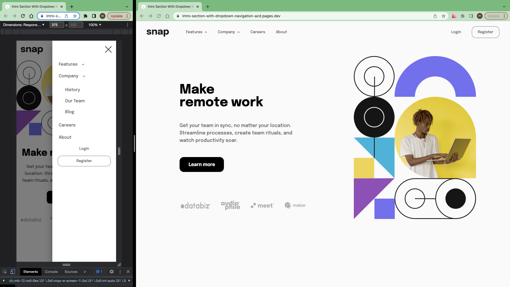

# Frontend Mentor - Intro section with dropdown navigation solution

This is a solution to the [Intro section with dropdown navigation challenge on Frontend Mentor](https://www.frontendmentor.io/challenges/intro-section-with-dropdown-navigation-ryaPetHE5).

## Table of contents

- [Overview](#overview)
  - [The challenge](#the-challenge)
  - [Screenshot](#screenshot)
  - [Links](#links)
- [My process](#my-process)
  - [Work time](#work-time)
  - [Built with](#built-with)
  - [What I learned](#what-i-learned)
  - [Useful resources](#useful-resources)
- [Author](#author)
- [Acknowledgments](#acknowledgments)

## Overview

### The challenge

Users should be able to:

- View the relevant dropdown menus on desktop and mobile when interacting with the navigation links
- View the optimal layout for the content depending on their device's screen size
- See hover states for all interactive elements on the page

### Screenshot



### Links

- Solution: [frontendmentor.io](https://www.frontendmentor.io/solutions/intro-section-with-dropdown-navigation-Bslsp0um9O)

- Live Site: [cloudflare](https://intro-section-with-dropdown-navigation-acd.pages.dev/)

## My process

- 1.Download assets, Install Vite & TailwindCss, Initialize git, README.md, Prepare project, ...
- 2.Create components
  - 1.Identify component
  - 2.Create components + style + functionality if exists
  - 3.go to step 1 (Identify component)
- 3.Prepare and Publish(4.Write README.md, Push to github, Make it live on Cloudflare, Publish to frontendmentor, ...)

### Work Time

- [My Clockify Report](https://app.clockify.me/shared/6486e024617c100dbe84d04a)

### Built with

- [React](https://react.dev/)
- [TailwindCss](https://tailwindcss.com/)
- [Framer Motion](https://framer.com/motion)

### What I learned

A div with absolute position get size of its children if:

- make display of div flex
- make flex-shrink of children 0

```jsx

<motion.div
  ...
  className="... flex"
>
  <ul className="... shrink-0">
    ...
  </ul>
</motion.div>

```

In this code each menu dropdown get appropriate width

### Useful resources

- [Multi Level Menu](https://blog.logrocket.com/how-create-multilevel-dropdown-menu-react/)

## Author

- Frontend Mentor - [@siavhnz](https://www.frontendmentor.io/profile/siavhnz)

- github - [@siavhnz](https://www.github.com/siavhnz)

## Acknowledgments

Thanks To

[Frontendmentor.io](https://www.frontendmentor.io/challenges) - for their Excitement challenges  

[Perfect Pixel](https://chrome.google.com/webstore/detail/perfectpixel-by-welldonec/dkaagdgjmgdmbnecmcefdhjekcoceebi?hl=en) - for such a great extension
